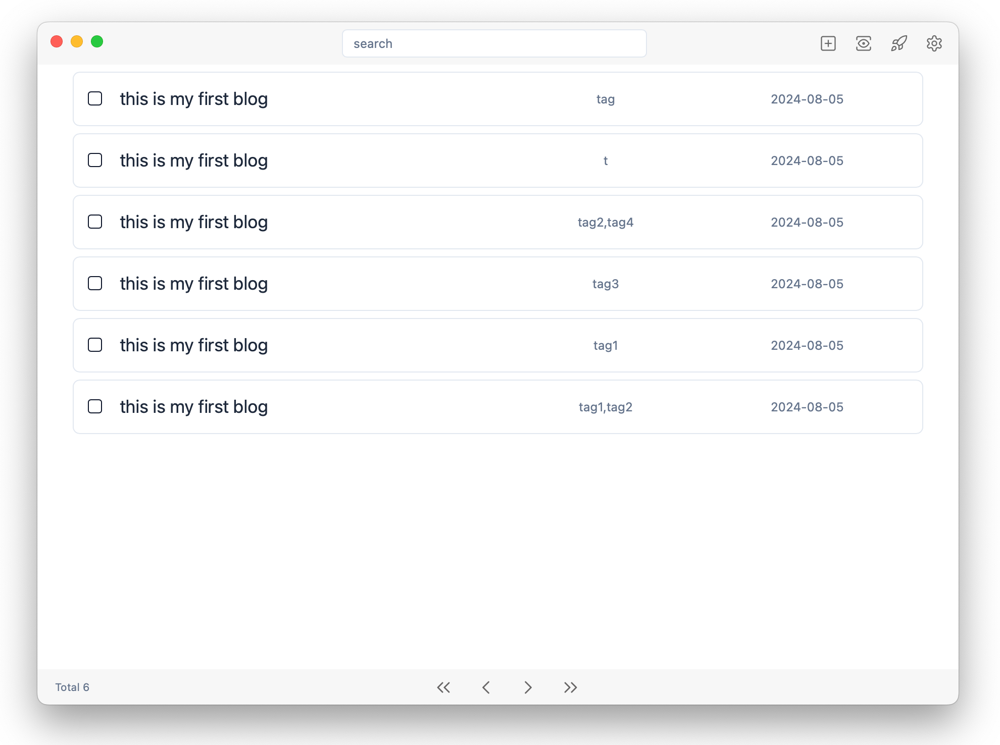
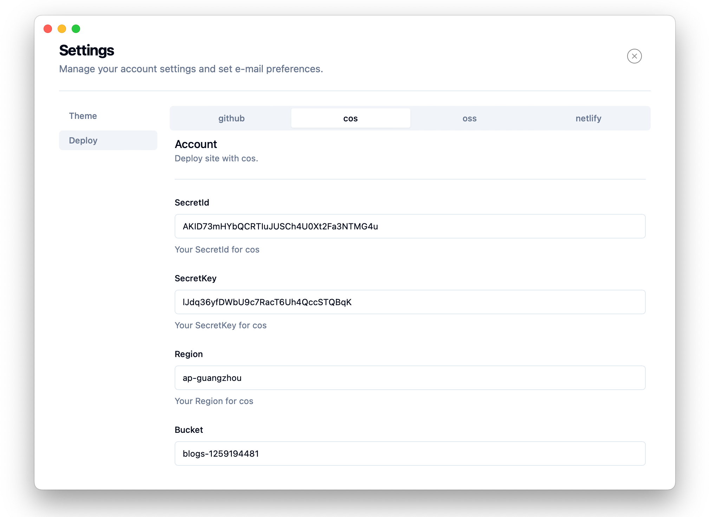
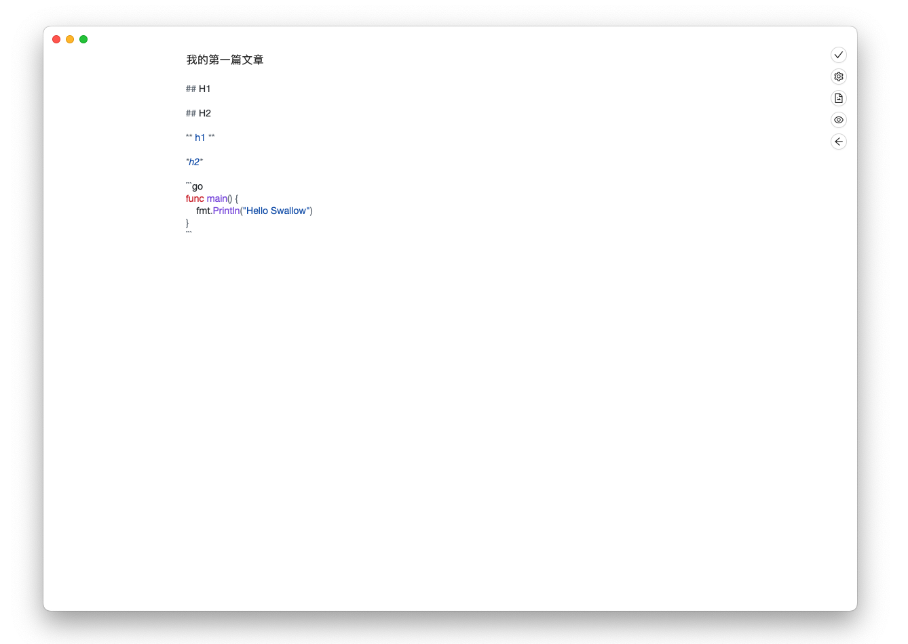

<h1 align='center'>Swallow</h1>

<p align="center">
   <br/>
</p>

<p align="center">
A cool static blog client.
</p>

<p align="center">
  <a href="https://github.com/rangwea/swallow-wails/blob/main/LICENSE">
    
  </a>
  <a href="https://fjwoo.cn">
    
  </a>
  <a href="https://wails.io/">
    
  </a>
  <a href="https://react.dev/">
    
  </a>
</p>

<div align="center">
<strong>
<samp>

[English](README.md) · [简体中文](README_zh_cn.md)

</samp>
</strong>
</div>

## About

Swallow is a simple gui desktop application for Hugo, so it is also a cool static blog client.

Swallow was being developed with Go using Wails. 

## Feature

- Simple article list management, you can search articles by titles and tags.
- Simple and cool Markdown editor, syntax highlighting, tags settings, Markdown preview, copy to insert pictures, drag and drop to insert pictures and file selector to insert pictures.
- Full platform support for Windows, MacOS and Linux.
- Preview site on local.
- Remote deployment to Github.
- [Hugo Theme](https://themes.gohugo.io/)，choose the look you like. Multiple built-in themes.





## Roadmap

- Picture Bed
- More remote deployment methods

## Deveplop

If you also love programming, you are welcome to contribute code.

#### Enviroment

- [GO](https://go.dev/doc/install)
- [Node](https://nodejs.org/en/learn/getting-started/how-to-install-nodejs)
- [Wails](https://wails.io/docs/next/gettingstarted/installation)

> As Swallow is mainly developed based on the Wails framework, the environment can be installed following the [installation tutorial of Wails](https://wails.io/docs/next/gettingstarted/installation), which includes the installation of Go and NPM.

```
git clone git@github.com:rangwea/swallow-wails.git
cd swallow-wails
wails dev
```

## Story

The project first author is a backend programmer mainly using Java and Python. He has worked on backend, middleware, and big data development. He likes to write small tools, so he taught himself some frontend knowledge.

The original intention of this project was to create a simple GUI wrapper for Hugo for a friend who is new to the field, allowing him to use Hugo to create his own blog.

There have been many explorations in the early stages of the project, resulting in multiple implementations of Swallow. Interested parties can follow the different implementations of Swallow for learning and discussion.

- [swallos-wails](https://github.com/rangwea/swallow-wails)： Base on [wails](https://wails.io/) framework using Go.
- [swallow-pywebview](https://github.com/rangwea/swallow-pywebview)： Base on [pywebview](https://pywebview.flowrl.com/) using Python，the frontend base on [alpinejs](https://alpinejs.dev/) and [tailwindcss](https://tailwindcss.com/)。
- [swallow-pyside](https://github.com/rangwea/swallow-pyside)： Base on [Pyside](https://doc.qt.io/qtforpython-6/).
