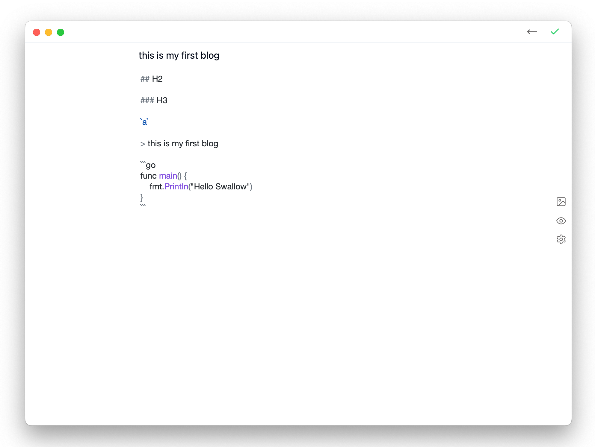

<h1 align='center'>Swallow</h1>

<p align="center">
   <br/>
</p>

<p align="center">
A cool static blog client.
</p>

<p align="center">
  <a href="https://github.com/rangwea/swallow-wails/blob/main/LICENSE">
    
  </a>
  <a href="https://fjwoo.cn">
    
  </a>
  <a href="https://wails.io/">
    
  </a>
  <a href="https://react.dev/">
    
  </a>
</p>

<div align="center">
<strong>
<samp>

[English](README.md) · [简体中文](README_zh_cn.md)

</samp>
</strong>
</div>

## About

`Swallow` 是一个静态博客客户端，它是一个 `Hugo` gui 工具。你可以使用 Swallow 创建、写作自己的博客。

Swallow 使用 Go 语言的 GUI 框架 [Wails](https://wails.io/) 开发。 

## 特性

- 简单的文章列表管理，可以根据标题、标签搜索文章
- 简单又酷的 Markdown 编辑器，语法高亮，标签设置、Markdown预览，复制插入图片、拖拽插入图片和文件选择器插入图片
- Windows、MacOS 和 Linux 全平台支持
- 本地预览站点
- Github 远程部署
- [Hugo 主题](https://themes.gohugo.io/)，选择你喜欢的样子。内置多款主题。




## Roadmap

- 图床
- 支持更多远程部署

## 开发

如果你也喜欢编程，欢迎贡献代码

#### 环境要求

- [GO 环境](https://go.dev/doc/install)
- [Node 环境](https://nodejs.org/en/learn/getting-started/how-to-install-nodejs)
- [Wails 安装](https://wails.io/docs/next/gettingstarted/installation)

> 因为 Swallow 主要基于 wails 框架开发，环境可以参考 [wails 的安装教程](https://wails.io/docs/next/gettingstarted/installation)，其中包括了 Go 和 NPM 的环境安装。

```
git clone git@github.com:rangwea/swallow-wails.git
cd swallow-wails
wails dev
```

## 故事

作者是一名后端程序员，主要开发语言是 Java 和 Python，做过后台、中间件和大数据开发。平时喜欢写写小工具，所以自学了一点前端知识。
这个项目的初衷是给一位小白朋友做一个简单的 Hugo GUI 封装，让他能够使用 Hugo 来创建自己的博客。
项目前期做过很多探索，所以 Swallow 有多个不同版本的实现，有兴趣的可以关注 Swallow 的不同实现，作为学习和讨论。

- [swallos-wails](https://github.com/rangwea/swallow-wails)： 基于 Go 的 [wails](https://wails.io/) 框架开发。
- [swallow-pywebview](https://github.com/rangwea/swallow-pywebview)： 基于 Python 的 [pywebview](https://pywebview.flowrl.com/) 框架开发，前端使用 [alpinejs](https://alpinejs.dev/) 和 [tailwindcss](https://tailwindcss.com/)。
- [swallow-pyside](https://github.com/rangwea/swallow-pyside)： 基于 [Pyside](https://doc.qt.io/qtforpython-6/) 开发。
